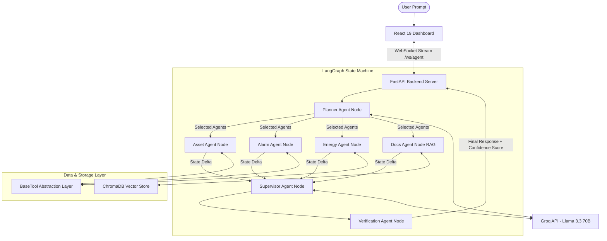

# AgenticOS — Architecture Document

## 1. System Overview

AgenticOS is a **Multi-Agent Operations Intelligence Platform** that autonomously analyzes building operational data using coordinated AI agents. Unlike traditional chatbots, it employs an **Agentic-First Architecture** where specialized agents are spawned dynamically based on the user's query.

### Key Architectural Principles
- **Selective Agent Spawning**: Only the agents needed for a query are created
- **Tool Abstraction Layer**: Mock tools can be replaced with real APIs without changing agent code
- **Real-Time Observability**: Every reasoning step, tool call, and agent lifecycle event is streamed to the UI
- **Graph-Based Orchestration**: LangGraph StateGraph provides deterministic, inspectable execution flows

---

## 2. System Architecture

### 🖼️ System Architecture Diagram


### 📊 Interactive Flow Diagram (Mermaid)



### 📐 Complete System Topology

```text
┌─────────────────────────────────────────────────────────────────────┐
│                        AgenticOS Web UI                             │
│  ┌──────────────┐  ┌──────────────────┐  ┌────────────────────┐    │
│  │ Conversation  │  │  Agent Execution  │  │ Reasoning Console  │    │
│  │   Panel       │  │     Graph         │  │ + Tool Viewer      │    │
│  │  (Chat I/O)   │  │  (React Flow)     │  │ + Token Monitor    │    │
│  └──────┬───────┘  └────────┬─────────┘  └──────────┬─────────┘    │
│         └──────────────┬────┘                        │              │
│                   WebSocket Connection               │              │
└───────────────────────┬──────────────────────────────┘              │
                        │                                              │
┌───────────────────────▼──────────────────────────────────────────────┐
│                     FastAPI Backend Server                            │
│  ┌─────────────────────────────────────────────────────────────┐     │
│  │              LangGraph Orchestration Engine                   │     │
│  │                                                               │     │
│  │  ┌──────────────┐                                             │     │
│  │  │ Planner Agent │──────┬──────────┬──────────┬──────────┐   │     │
│  │  └──────────────┘      │          │          │          │   │     │
│  │                    ┌────▼───┐ ┌────▼───┐ ┌────▼───┐ ┌───▼────┐│     │
│  │                    │ Asset  │ │ Alarm  │ │Energy  │ │  Docs  ││     │
│  │                    │ Agent  │ │ Agent  │ │ Agent  │ │ Agent  ││     │
│  │                    └────┬───┘ └────┬───┘ └────┬───┘ └───┬────┘│     │
│  │                         └──────┬───┘──────┬───┘─────────┘     │     │
│  │                           ┌────▼────────────┐                  │     │
│  │                           │Supervisor Agent  │                  │     │
│  │                           └─────────────────┘                  │     │
│  └─────────────────────────────────────────────────────────────┘     │
│                                                                      │
│  ┌─────────────────────────────────────────────────────────────┐     │
│  │              Tool Abstraction Layer                           │     │
│  │  ┌─────────────────┐    ┌─────────────────┐                  │     │
│  │  │   BaseTool ABC   │◄───│  MockAssetTool  │  (Current)      │     │
│  │  │                  │◄───│  MockAlarmTool  │                  │     │
│  │  │  execute(**kw)   │◄───│  MockEnergyTool │                  │     │
│  │  │  → ToolResult    │◄───│  MockDocTool    │                  │     │
│  │  │                  │    └─────────────────┘                  │     │
│  │  │                  │◄───┌─────────────────┐                  │     │
│  │  │                  │    │  BACnetAssetTool │  (Future)       │     │
│  │  │                  │◄───│  SCADAEnergyTool│                  │     │
│  │  └─────────────────┘    └─────────────────┘                  │     │
│  └─────────────────────────────────────────────────────────────┘     │
│                                                                      │
│  ┌─────────────────────┐    ┌──────────────────┐                    │
│  │  Simulated Data      │    │  RAG Pipeline     │                    │
│  │  • assets.json       │    │  • ChromaDB        │                    │
│  │  • alarms.json       │    │  • Embeddings      │                    │
│  │  • energy.json       │    │  • Document Search  │                    │
│  └─────────────────────┘    └──────────────────┘                    │
└──────────────────────────────────────────────────────────────────────┘
                        │
                  ┌─────▼─────┐
                  │  Groq API  │  (LLM Inference)
                  │  Llama 3.3 │
                  │  70B       │
                  └───────────┘
```

---

## 3. Agent Orchestration Design

### 3.1 LangGraph State Machine

The orchestration uses a **LangGraph StateGraph** — a directed graph where:
- **Nodes** = Agent functions
- **Edges** = Data flow paths
- **Conditional Edges** = Dynamic routing based on planner output
- **State** = `AgentState` TypedDict shared across all nodes

```
Entry Point → planner
                │
    ┌───────────┼───────────┬───────────┐
    ▼           ▼           ▼           ▼
asset_agent alarm_agent energy_agent docs_agent
    │           │           │           │
    └───────────┼───────────┴───────────┘
                ▼
           supervisor → END
```

### 3.2 AgentState Schema

```python
class AgentState(TypedDict):
    messages: list[BaseMessage]          # Chat history
    user_query: str                      # Original query
    execution_plan: dict                 # Planner output
    agents_to_spawn: list[str]           # Selected agents
    agent_results: dict[str, AgentResult] # Results per agent
    reasoning_trace: list[ReasoningStep] # All reasoning steps
    tool_invocations: list[ToolInvocation] # All tool calls
    total_prompt_tokens: int             # Token tracking
    total_completion_tokens: int
    total_tool_calls: int
    final_response: str                  # Supervisor output
```

### 3.3 Selective Spawning Logic

The Planner Agent uses structured JSON output to decide which agents to spawn:

| Query Type | Agents Spawned | Example |
|---|---|---|
| Knowledge question | Documentation only | "What is BACnet?" |
| Alarm investigation | Alarm + Asset + Docs | "Investigate high temp alarm" |
| Energy analysis | Energy only | "Show energy for Chiller-01" |
| Full diagnostics | All agents | "Full diagnostics on AHU-01" |

---

## 4. Data Flow Diagram

```
User Query: "Investigate high temperature alarm on AHU-01"
│
▼
[Planner Agent]
├── Understands: Alarm investigation on AHU-01
├── Plans: Need asset info, alarm details, relevant SOPs
├── Spawns: asset_agent, alarm_agent, documentation_agent
│
├─── [Asset Agent]
│    ├── Calls: get_asset("AHU-01")
│    ├── Calls: get_related_assets("AHU-01")
│    └── Returns: Asset details, connected equipment
│
├─── [Alarm Agent]
│    ├── Calls: get_alarm_history("AHU-01")
│    ├── Calls: correlate_alarms("ALM-001")
│    └── Returns: Alarm details, correlations, root causes
│
├─── [Documentation Agent]
│    ├── Calls: retrieve_sop("high temperature")
│    └── Returns: Relevant SOPs and procedures
│
▼
[Supervisor Agent]
├── Collects all 3 agent results
├── Synthesizes findings
├── Produces: Executive Summary + Detailed Findings + Actions
│
▼
Final Response → User (via WebSocket)
```

---

## 5. Technology Stack

| Layer | Technology | Purpose |
|---|---|---|
| Frontend | React 18 + Vite | UI framework |
| Agent Graph | React Flow (@xyflow/react) | Visual orchestration graph |
| Charts | Recharts | Token/cost monitoring |
| Icons | Lucide React | UI icons |
| Styling | Vanilla CSS | Full design control |
| Backend | FastAPI | API server + WebSocket |
| Orchestration | LangGraph | Agent workflow engine |
| LLM | Groq API + LangChain | Fast open-source inference |
| Vector DB | ChromaDB | Document search (RAG) |
| Embeddings | sentence-transformers | Text embeddings |

---

## 6. Future API Integration Approach

The Tool Abstraction Layer enables seamless migration from mock to production:

| Current Mock Tool | Future Real Tool | Target API |
|---|---|---|
| `MockAssetTool` | `BACnetAssetTool` | CMMS / BACnet API |
| `MockAlarmTool` | `AlarmAPITool` | BMS Alarm API |
| `MockEnergyTool` | `SCADAEnergyTool` | SCADA / Energy Meter API |
| `MockDocumentTool` | `DMSTool` | Document Management System |

### Migration Steps:
1. Create new class extending `BaseTool`
2. Implement `_execute()` with real API calls
3. Update `tools/__init__.py` registry to use new class
4. **Zero changes to any agent code**

```python
# Before (Mock):
TOOL_REGISTRY = {"get_asset": MockGetAsset()}

# After (Production):
TOOL_REGISTRY = {"get_asset": BACnetGetAsset(api_url="...")}
```

---

## 7. Communication Protocol

### WebSocket Events (Backend → Frontend)

| Event Type | Payload | Trigger |
|---|---|---|
| `query_received` | `{query, timestamp}` | User submits query |
| `planner_complete` | `{plan, agents_to_spawn}` | Planner finishes |
| `agent_spawned` | `{agent, timestamp}` | Agent created |
| `reasoning_step` | `{agent, thought, action}` | Agent reasoning |
| `tool_invocation` | `{agent, tool, params, output, time}` | Tool called |
| `agent_complete` | `{agent, status, tools_used, time}` | Agent done |
| `final_response` | `{response, token_usage, time}` | Final answer |
| `error` | `{message}` | Error occurred |
